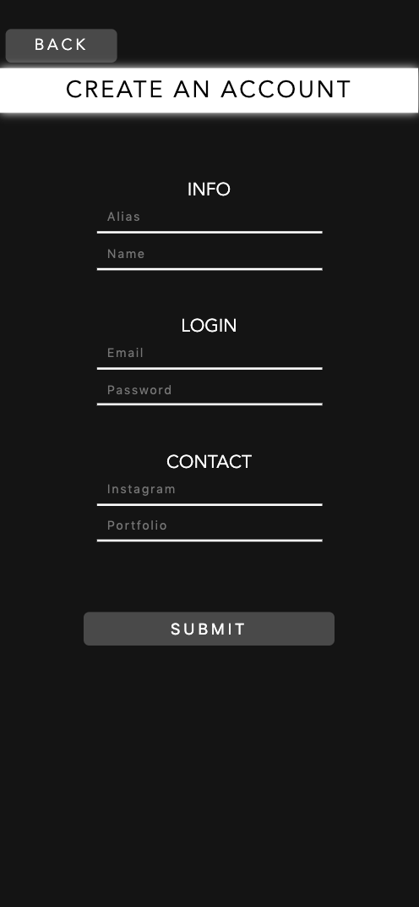
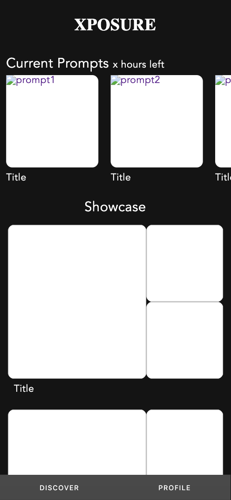
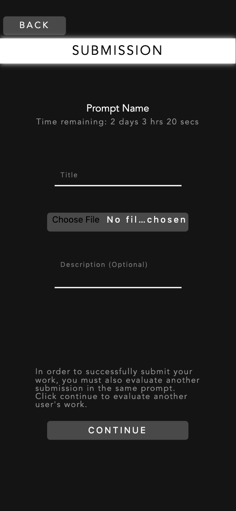
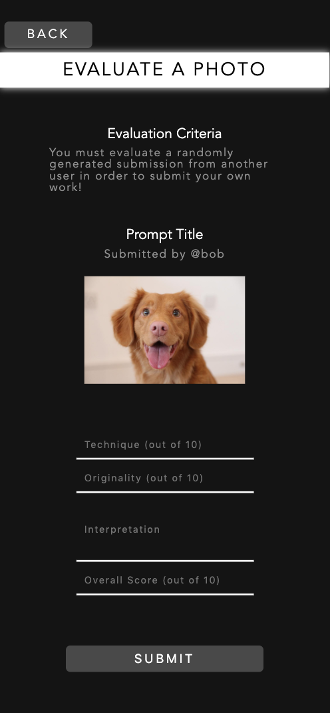

# Milestone 4

#### Table of Contents
1. [Logistics](#Logistics)
2. [UI Skeleton Webpage Screenshots](#Skeleton)
3. [User Actions](#UserActions)

## Logistics
**Team Name**: Panda Express.js 

**Members**:
1. Kai-ling Peng
2. Martin Magsombol
3. Ryan Keng
4. Yidong Luo

### UI Skeleton Webpage Screenshots

For milestone4, we merged the ongoing prompts and finished prompts page to display both on the home page. We worked on the styling for each page in order for it to be consistent.

User is able to sign-in or create an account if they don't have one yet. 
 

User is able to create an account. 
 

Users are able to view different ongoing and finished prompts in the home page. 
 

Users are able to view ongoing prompts and their submitted works. 
 

Users are able to submit their works for each prompt. 
 

Users are able to evaluate other people's works for each prompt. 
 

Users are able to view their account information and submitted works in their profile. 
 

Users are able to edit their account information. 
 

### User Action 1
User submits an image for a prompt.

1. User has an Xposure account.
2. User visits `index.html` and fills in his/her email and password, and clicks "Log In".
3. User is taken to `Discover.html`, and clicks on one of the Current Prompts available.
4. User is taken to `Prompt.html`, and clicks on "Submit My Work".
5. User is taken to `Submission.html`, where 3 input form fields will be displayed. The user fills in the title, uploads an image (jpeg), and fills in the description (optional). The user clicks on "Continue" to proceed.

### User Action 2
User submits an evaluation for a submission.

Following the steps above, the user is required to submit an evaluation for a randomly selected submission in order to complete his/her submission progress.

6. User is taken to `Evaluate.html`, where 4 input form fields will be displayed. The user fills in the rating for technique (1-10), originality (1-10), a sentence or two for interpretation, and an overall score (1-10). The user clicks on "Submit" to proceed.
7. User is taken to `Disocover.html`.
