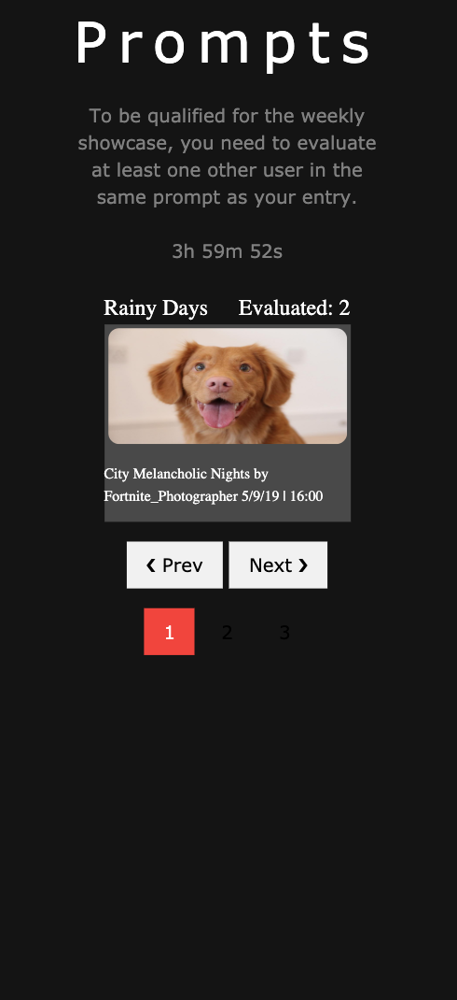

# Milestone 4

#### Table of Contents
1. [Logistics](#Logistics)
2. [UI Skeleton Webpage Screenshots](#Skeleton)
3. [User Actions](#UserActions)

## Logistics
**Team Name**: Panda Express.js 

**Members**:
1. Kai-ling Peng
2. Martin Magsombol
3. Ryan Keng
4. Yidong Luo

### UI Skeleton Webpage Screenshots
TODO:
milestone4.md contains a written explanation of how your UI's screenshots have improved upon the versions shown in milestone3.md in a noticeable way.

User is able to sign-in or create an account if they don't have one yet. 
 

User is able to create an account. 
 

Users are able to view different finished prompts in the home page. 
 

Users are able to view ongoing prompts. 
 

Users are able to submit their works for each prompt. 
 

Users are able to evaluate other people's works for each prompt. 
 

Users are able to view their account information and submitted works in their profile. 
 

Users are able to edit their account information. 
 

Users are able to change their account settings. 
 

TODO:
milestone4.md contains a written description of at least two non-trivial actions that users can perform when they use your app. These should not be simply logging in or opening static webpages; they need to be substantive actions that demonstrate your app's core functionality, and also differ from one another in a significant way (2 points).

### User Action 1

### User Action 2
